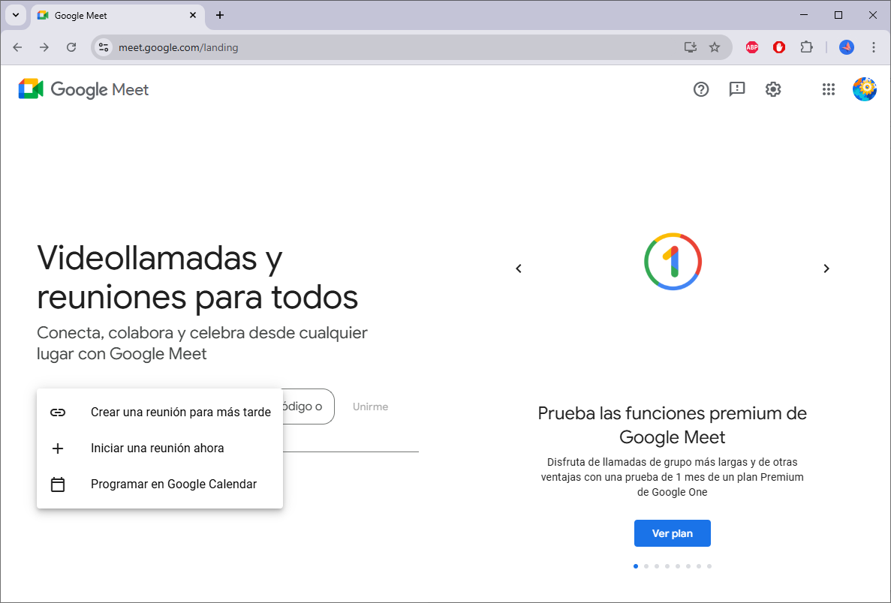
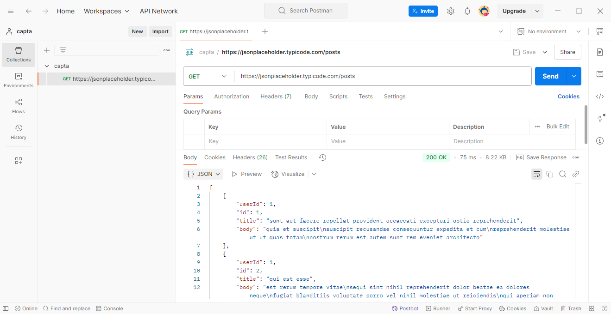
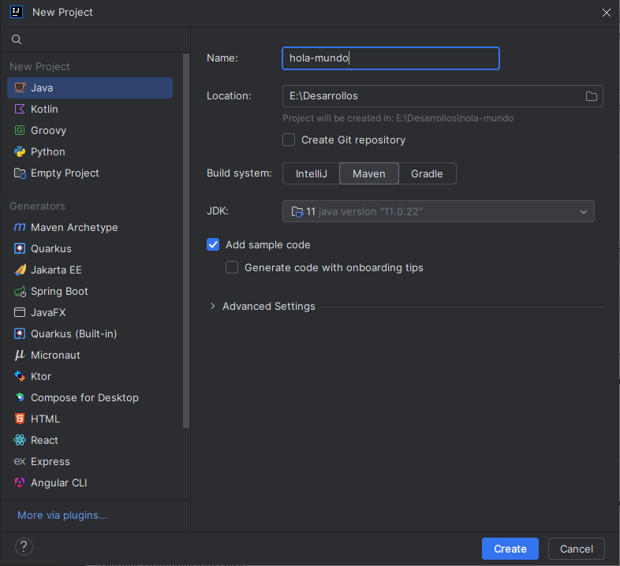
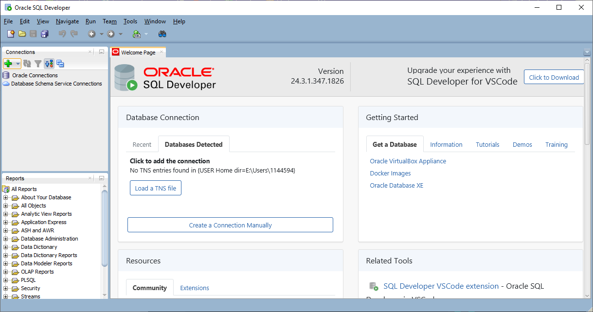
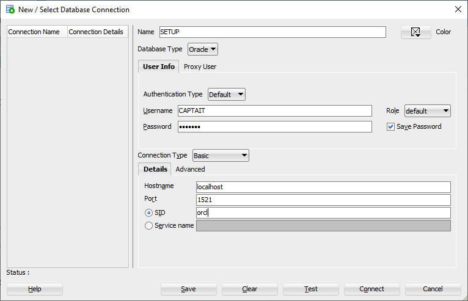
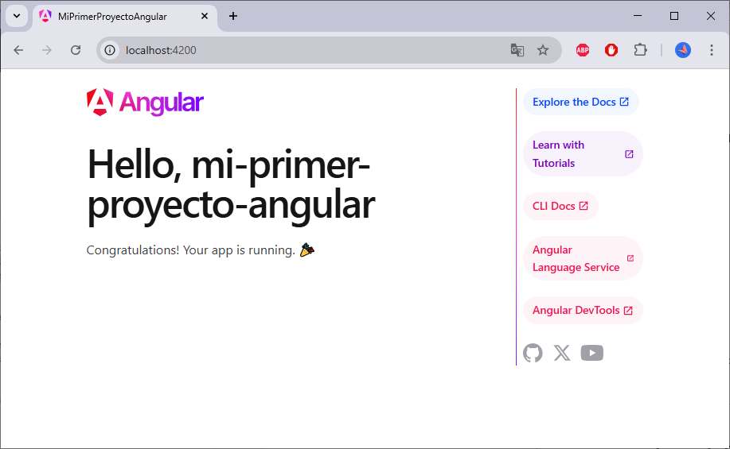

# 🚀 **Guía Definitiva para Preparar tu PC con Windows**

¡Prepárate para convertir tu computadora en un cohete 🚀 con todo lo necesario para **Google Meet, Java 11, IntelliJ IDEA, Postman, Oracle Database, SQL Developer y más**! 🖥️✨  

Sigue estos pasos detallados y estarás listo para conquistar el mundo del desarrollo en un abrir y cerrar de ojos. 👩‍💻👨‍💻  

No te preocupes si nunca has hecho esto antes, ¡todo está explicado paso a paso! Solo necesitas tu PC con Windows y un poco de paciencia. Al terminar, tendrás todo lo necesario para comenzar el bootcamp y dar el primer paso hacia convertirte en un desarrollador profesional. 🌟  

📌 _Si ya tienes alguna de estas herramientas instaladas, verifica que tengas las **versiones correctas** para evitar inconvenientes durante el curso._ 

---
<!-- 3. [Configuración de Windows](#configuración-de-windows)  
   - [Verifica tu Versión de Windows](#verifica-tu-versión-de-windows)  
   - [Actualización de Windows](#actualización-de-windows)  
   - [Solución de Problemas de Actualización](#solución-de-problemas-de-actualización)   -->

## 📋 **Índice** 
1. [Google Chrome](#chrome-tu-navegador-principal) 
2. [Google Meet](#prepara-google-meet) 
3. [Instalación y Configuración de Herramientas](#instalación-y-configuración-de-herramientas)  
   - [Git Bash](#git-bash)  
   - [GitHub](#github)  
   - [Java 11](#java-11) 
   - [IntelliJ IDEA](#intellij-idea) 
   - [Visual Studio Code](#visual-studio-code) 
   - [Postman](#postman) 
   - [Docker](#docker) 
   - [Oracle Database Server](#oracle-database) 
   - [SQL Developer](#sql-developer) 
   - [Node.js y Angular](#nodejs-y-angular)  

---
<a id="chrome-tu-navegador-principal"></a>
##  **Chrome - Tu Navegador Principal**  

Para garantizar una experiencia fluida durante todo el curso, recomendamos usar **Google Chrome** como tu navegador predeterminado. Es la opción más compatible con las herramientas que utilizaremos, incluidos Google Meet, pruebas de código.

1. **Descarga Google Chrome**   👉 [Instalación de Google Chrome](https://www.google.com/chrome/)  
2. Abre el instalador que se descargará automáticamente.
3. Sigue las instrucciones en pantalla para completar la instalación.
4. Al finalizar la instalación, se te ofrecerá la opción de establecer Google Chrome como tu navegador predeterminado. Haz clic en **Aceptar**.

### **¿Por qué recomendamos Google Chrome?**  
Es rápido, estable y funciona mejor para pruebas de código y herramientas modernas. Si prefieres otra opción, **Firefox** también es válido, pero evita navegadores como Opera, Safari o Internet Explorer, ya que pueden causar problemas.

---

<a id="prepara-google-meet"></a>
##  **Prepara Google Meet** 
Google Meet será nuestra herramienta para reuniones y clases en línea. Asegúrate de tener una conexión estable y sigue estos pasos para configurarlo correctamente:
  1. Abre tu navegador `Chrome`.  
  2. Si aún no has iniciado sesión, usa tu cuenta de Google o crea una nueva.
  3. Ve a Google Meet: [https://meet.google.com/](https://meet.google.com/)  
  3. Crea una reunión de prueba y da permisos para micrófono 🎙️ y cámara 📷.  



⚙️ **Tip Pro:** Si tienes problemas, actualiza los drivers de tu cámara y micrófono desde el **Administrador de Dispositivos** de Windows o **revisa los permisos en Chrome** Configuración → Privacidad y seguridad → Configuración del sitio → Cámara y micrófono.


<!-- ---
<a id="configuración-de-windows"></a>
##   **Windows**  

### **¿Qué versión de Windows tienes?** 🤔  
Antes de continuar, necesitamos saber qué versión tienes instalada.  

1. Presiona `Windows` + `R`.  
2. Escribe `winver` y presiona `Enter`.  
   - Verás una ventana con información como:  
     - **Edición:** Windows 10 o 11.  
     - **Versión:** Un número como `22H2` o `1903`.  

<a id="prepara-google-meet"></a>
### **¿Necesitas actualizar tu Windows?** 🔄  
Si tu versión es más antigua que `1903`, ¡no te preocupes! Aquí está la solución:  

#### **Actualizar a Windows 10 o 11**  
1. Ve a la [página oficial de Microsoft](https://www.microsoft.com/software-download/windows10ISO).  
2. Descarga el instalador de Windows 10.  
3. Sigue las instrucciones en pantalla para actualizar.  
   - Este proceso puede tardar un rato (prepárate un café ☕).  

Si tu computadora ya soporta Windows 11:  
- Ve a [Microsoft Windows 11](https://www.microsoft.com/windows/get-windows-11) y sigue los pasos para la actualización.  

<a id="prepara-google-meet"></a>
### **Instala las últimas actualizaciones** 🛠️  
Para asegurarte de que todo funcione correctamente, instala las actualizaciones más recientes:  

1. Abre **Windows Update**:  
   - Presiona `Windows` + `R`, escribe `ms-settings:windowsupdate` y presiona `Enter`.  

2. Haz clic en **Check updates** (Buscar actualizaciones).  

:heavy_check_mark: Si dice "You're up to date", ¡todo está bien! 🎉  
:x: Si aparecen actualizaciones disponibles, instálalas y vuelve a comprobar.  

<a id="prepara-google-meet"></a>
### **Solucionar problemas de actualización** 🔧  
Si Windows Update no funciona:  
1. Presiona `Windows` + `R` y escribe `services.msc`.  
2. Busca **Windows Update Service** en la lista.  
3. Haz doble clic, configura el **Startup Type** en `Automatic` y haz clic en **Start**.  

🚀 **Ahora inténtalo de nuevo!**   -->

---

<a id="github"></a>
##  **Cuenta GitHub** 

### **Creación de tu cuenta**  
GitHub es una plataforma para almacenar y compartir código. En este bootcamp lo usaremos para guardar tus proyectos, trabajar en equipo y construir tu portafolio como desarrollador.  

_Si ya tienes una cuenta, úsala y avanza al siguiente nivel. ¡Más tiempo para codear! 🚀_

1. Ve a [GitHub](https://github.com/join) y regístrate con:  
   - **Username:** Elige algo profesional.  
   - **Email:** Usa tu correo principal.  
   - **Contraseña:** Hazla segura.  

2. ¡Crea tu cuenta y listo! 🎉

<details>
   <summary>✨ Opcional: Personaliza tu perfil y mejora tu seguridad</summary>

   - **Sube una foto:** Ve a [Configuración de perfil](https://github.com/settings/profile).  
   - **Habilita el 2FA:** En [Seguridad](https://github.com/settings/security), activa la autenticación en dos pasos para proteger tu cuenta.  
</details>

<details>
   <summary>📁 Crea tu primer repositorio</summary>

   1. Haz clic en **New Repository**.  
   2. Dale un nombre y marca **Initialize with a README**.  
   3. Haz clic en **Create Repository**. 🎉 ¡Tu repo está listo!  
</details>

--- 
<a id="java-11"></a>
##  **Java 11**

Java 11 es el motor detrás de muchas aplicaciones modernas. Es esencial para ejecutar, desarrollar y probar proyectos en varios entornos. Sin Java, no hay desarrollo Java. 🚀

🚦 **Pasos para instalar Java 11:**  
1. Ve a la página oficial de Java:  
   👉 Descarga aquí: [https://www.oracle.com/java/technologies/javase-jdk11-downloads.html](https://www.oracle.com/java/technologies/javase-jdk11-downloads.html)  
2. Descarga el instalador para **Windows x64 Installer**.  
3. Ejecuta el archivo `.exe` descargado.  
4. Sigue el asistente de instalación:  
   - Acepta los términos.  
   - Usa la ruta de instalación por defecto.  
5. Abre el **Símbolo del sistema (CMD)** y verifica la instalación escribiendo:  
   ```bash
   java -version
   ```  
   Deberías ver algo como: `java version "11.x.x"`. 🎉  

Java quedará por defecto en una ruta como esta `C:\Program Files\Java\jdk-11.x.x`

### **✨ Tip Pro**
- **Configura la variable de entorno `JAVA_HOME`:**  
   Esto asegurará que otras herramientas reconozcan dónde está instalado Java. Sigue estos pasos:  
   1. Ve a **Configuración del sistema** y busca **Variables de entorno**.  
   2. Crea una nueva variable con:  
      - **Nombre:** `JAVA_HOME`  
      - **Valor:** La ruta donde instalaste Java (ejemplo: `C:\Program Files\Java\jdk-11.x.x`).  
   3. Añade `%JAVA_HOME%\bin` a la variable `Path`.  
   4. Guarda los cambios y reinicia el CMD para que surtan efecto.

---
<a id="visual-studio-code"></a>
##   **Visual Studio Code** 

### Instalación  
Instala el editor de texto más popular del universo: [Visual Studio Code](https://code.visualstudio.com).  

1. Ve a [la página oficial de descargas](https://code.visualstudio.com/download).  
2. Haz clic en el botón "Windows" para descargar el instalador.  
3. Abre el archivo descargado y sigue estos pasos:  
   - Acepta los términos y condiciones (tranqui, no es un contrato para vender tu alma).  
   - Marca la opción para **Agregar a PATH** (muy importante).  
   - Haz clic en "Siguiente" hasta que termine la instalación.  
      📌  **Tip Pro:** Si no marcas la opción de agregar a PATH, no podrás usar `code` en la terminal.  
4. Abre Visual Studio Code desde el menú de inicio.  
   🎉 ¡Ya tienes tu editor listo para brillar!  

---
<a id="postman"></a>
##    **Postman**  

Postman es una herramienta imprescindible para desarrollar y probar APIs. Te permite enviar solicitudes HTTP, depurar errores y analizar respuestas de forma sencilla. 

📥 **Pasos para instalar Postman:**  
1. Descarga desde [https://www.postman.com/downloads/](https://www.postman.com/downloads/).  
2. Abre el instalador y sigue las instrucciones.  
3. Inicia sesión o crea una cuenta para obtener el máximo de esta herramienta.  

<details>
  <summary>✨ Primeros Pasos con Postman (Opcional)</summary>

1. **Crear un Workspace:**
   - Ve a la pestaña **Workspaces** y selecciona **Create Workspace**.
   - Crea un workspace en blanco o prueba algún template.
   - Escribe un nombre (por ejemplo, `Mi Primer Workspace`) y selecciona el tipo "Personal".

2. **Realiza tu Primera Solicitud:**
   - Haz clic en **Nuevo** y selecciona **HTTP**.
   - Elige el tipo de solicitud (GET, POST, PUT, DELETE, etc.) en la barra superior.
   - Escribe una URL de prueba, como:  
     ```
     https://jsonplaceholder.typicode.com/posts
     ```
   - Haz clic en **Send** (Enviar) y observa la respuesta en la sección inferior.

3. **Colecciones:**  
   - Organiza tus solicitudes en colecciones para trabajar de manera ordenada.  
   - Crea una nueva colección desde la barra lateral izquierda y agrégale solicitudes relacionadas.

4. **Entornos y Variables:**  
   - Usa entornos para configurar variables reutilizables (por ejemplo, URLs base o tokens de autenticación).  
   - Define variables en el apartado **Environments** y úsalas en las solicitudes con la sintaxis:  
     ```
     {{variable}}
     ```



</details>

---
<a id="intellij-idea"></a>
##   **IntelliJ IDEA**  

IntelliJ IDEA es una herramienta potente para desarrolladores Java. Es un IDE que permite escribir y ejecutar código de forma más cómoda y rápida, optimizando el flujo de trabajo.

🛠️ **Pasos para instalar IntelliJ IDEA:**  
1. Descarga IntelliJ IDEA Community (gratis):  
   👉 [https://www.jetbrains.com/idea/download/](https://www.jetbrains.com/idea/download/)  
2. Selecciona **Community Edition**.  
3. Ejecuta el instalador `.exe` y sigue las instrucciones:  
   - Acepta los términos.  
   - Crea un acceso directo y asocia `.java` con IntelliJ.  
4. Inicia IntelliJ y selecciona un tema (oscuro 🌙 o claro ☀️).  

<details>
  <summary>✨ Opcional: Prueba tu instalación (Opcional) </summary>

### **Prueba tu Instalación**
1. **Crea un proyecto nuevo:**
   - Haz clic en **New Project** y selecciona **Java**.  
   - Configura el JDK apuntando a tu instalación de Java 11.  

2. **Código de prueba:**  
   Crea un archivo `Main.java` en la carpeta `src` con este código:  
   ```java
   public class Main {
       public static void main(String[] args) {
           System.out.println("¡Hola, mundo!");
       }
   }
   ```
   - Haz clic en el botón **Run** (triángulo verde) para ejecutarlo.

### **Tips Pro**
- **Atajos útiles:**  
  - Ejecutar código: `Shift + F10`.  
  - Buscar: `Shift + Shift`.  
  - Formatear código: `Ctrl + Alt + L`.  

- **Plugins recomendados:**  
  - **Lombok Plugin**: Para proyectos que usen Lombok.  
  - **Key Promoter X**: Aprende atajos mientras trabajas.

</details>

---
<a id="docker"></a>
##   **Docker**

Docker nos permite crear y ejecutar aplicaciones en contenedores, simplificando el desarrollo y despliegue. Aquí tienes cómo instalarlo paso a paso:

_Si ya tienes Docker instalado en tu máquina, por favor actualízalo con la versión más reciente_
  
1. **Descarga Docker Desktop 🐳 :**  
   Ve al sitio oficial 👉 [Descargar Docker Desktop](https://www.docker.com/products/docker-desktop) y selecciona la versión para Windows.

2. **Ejecuta el instalador:**  
   - Abre el archivo descargado (`Docker Desktop Installer.exe`).  
   - Sigue las instrucciones:  
     - Acepta los términos de la licencia.  
     - Activa la opción para usar **WSL 2** (Windows 10/11).  

3. **Reinicia tu PC:**  
   - Después de instalar, reinicia tu computadora para que los cambios surtan efecto.  

4. **Inicia sesión en Docker Hub:**  
   - Abre Docker Desktop y te pedirá que inicies sesión.  
   - Si no tienes una cuenta, crea una gratis en [Docker Hub](https://hub.docker.com/).  

5. **Verifica la instalación:**  
   Abre una terminal y escribe:  
   ```bash
   docker --version
   ```
   Si ves algo como `Docker version XX.XX`, ¡ya está listo! 🎉  


<details>
  <summary>✨ Prueba rápida (Opcional) </summary>

   ### **Prueba rápida**  
   Si quieres asegurarte de que Docker funciona correctamente, ejecuta este comando en la terminal:  
   ```bash
   docker run hello-world
   ```
   Deberías ver un mensaje de éxito.

</details>

---
<a id="oracle-database"></a>
##   **Oracle Database Server**

 **¿Por qué Oracle Database 19c?**  
Es una de las bases de datos más robustas y usadas en el mundo empresarial. **Oracle 19c** es una versión de soporte a largo plazo (LTS) y **es compatible con Java 11**, lo que la hace ideal para los proyectos que trabajarás en el bootcamp.


1. Descarga el instalador para **Microsoft Windows x64 (64-bit)**:  
   👉 [https://www.oracle.com/database/technologies/oracle19c-windows-downloads.html](https://www.oracle.com/database/technologies/oracle19c-windows-downloads.html)  
2. Inicia sesión o crea una cuenta Oracle y descomprime el archivo descargado.  
3. Ejecuta el archivo `setup.exe` como administrador.  
4. Sigue el asistente de instalación:  
   - Selecciona “Create and configure a single instance database”.  
   - Define una contraseña para el usuario administrador.  

---

<a id="sql-developer"></a>
##   **Ejecuta SQL Developer** 

 **¿Qué es SQL Developer?**  
Un IDE visual para interactuar con Oracle y otras bases de datos.  Es uno de los más utilizados por empresas con bases de datos oracle.

Este es un ejecutable portatil por lo que no tendrás que instalarlo directamente en tu sistema.

1. Descarga desde [https://www.oracle.com/mx/database/sqldeveloper/technologies/download/](https://www.oracle.com/mx/database/sqldeveloper/technologies/download/)  
2. Selecciona **Windows 64-bit** y da click en descargar, luego descomprime el archivo `.zip`.  
3. Ejecuta el archivo `sqldeveloper.exe` para que puedas probarlo.

   


### 🛠️ **¡Hora de conectar tu base de datos Oracle!**  

Este paso es importante, ya que validaremos que tanto el servidor como el IDE estén funcionando correctamente.

1. **Crea tu conexión:**  
   - Abre SQL Developer y haz clic en el ícono **+** (o selecciona **New Connection**). ¡Es como darle vida a tu base de datos!  

2. **Dale un nombre épico a tu conexión:**  
   - **Connection Name:** Llámala como quieras, algo como `SETUP` funciona perfecto.  
   - **Username:** Escribe el nombre de usuario, por ejemplo, `CAPTAIT`.  
   - **Password:** Define una contraseña y asegúrate de marcar la opción **Save Password** para no olvidarla (nadie quiere escribirla cada vez 😅).

3. **Configura los detalles técnicos (tranquilo, es más fácil de lo que suena):**  
   - **Database Type:** Asegúrate de que diga `Oracle` (porque es lo que estamos usando).  
   - **Hostname:** Escribe `localhost`, porque tu base está corriendo localmente (obvio).  
   - **Port:** El puerto predeterminado es `1521` (ni lo toques si no sabes qué significa).  
   - **SID:** Este es el identificador de la base. Usa `orcl` o lo que configuraste durante la instalación.  

4. **Testea y conecta (¡el momento de la verdad!):**  
   - Haz clic en el botón **Test** para ver si todo está funcionando.  
   - ¿Ves un bonito **Success**? ¡Perfecto, ya tienes conexión! Ahora haz clic en **Connect** y empieza a trabajar. 🎉  

   

<details>
  <summary>📌 Tip Extra </summary>

Si buscas probar otro IDE, dale una oportunidad a **DBeaver**. Es gratuito, de código abierto y compatible con múltiples bases de datos, incluidas Oracle, MySQL, PostgreSQL y más. ¡Ideal si trabajas con varias bases de datos al mismo tiempo!  
👉 [Descargar DBeaver](https://dbeaver.io/)
</details>


---

<a id="oracle-database"></a>
## **  Angular |   Node.js** 

🔹 **¿Por qué Angular y Node.js?**  
Angular es uno de los frameworks más populares para desarrollar aplicaciones web modernas, y Node.js es esencial para manejar dependencias y ejecutar herramientas clave como Angular CLI.


🛠️ **Pasos para configurar:**  

1. **Descargar Node.js:**  
   👉 [https://nodejs.org/](https://nodejs.org/)  
2. **Instalar Node.js:**  
   - Durante la instalación, marca la opción para agregar Node.js al PATH. Esto permitirá que lo uses desde cualquier terminal.
3. **Verificar instalación:**  
   ```bash
   node -v
   npm -v
   npm install -g npm@latest
   ```  
4. **Instalar Angular CLI:**  
   ```bash
   npm install -g @angular/cli
   ```  
5. **Crear un proyecto Angular:**  
   ```bash
   mkdir -p ~/captait/00-Setup/01-Angular && cd $_
   ng new mi-primer-proyecto-angular
   cd mi-primer-proyecto-angular
   ng serve
   ```  
   Abre [http://localhost:4200](http://localhost:4200) para ver tu aplicación.  

   

---

## 🎉 ¡Felicidades! Tu entorno de desarrollo está listo para el bootcamp. 🚀

